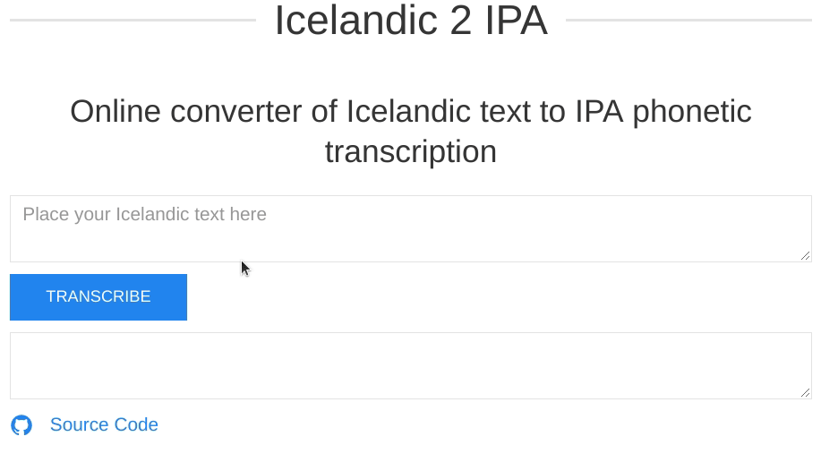

<p align="center"><i>
  Project 2<br/>
  MLT201F Language resources for software development and research, 2019-1 <br/>
  University of Iceland - School of Humanitie , Sæmundargata 2, IS-101 Reykjavik, Iceland
</i></p>


<p align="center">
Online converter of Icelandic text to IPA phonetic transcription<br/>
</p>


## Table of Contents
<!-- ⛔️ MD-MAGIC-EXAMPLE:START (TOC:collapse=true&collapseText=Click to expand) -->
<details>
<summary>Click to expand</summary>

1. [Introduction](#1-introduction)
2. [The Dataset](#2-the-dataset)
3. [Setup](#3-setup)
4. [Authors](#4-authors)
5. [License](#5-license)
6. [References](#6-references)

</details>
<!-- ⛔️ MD-MAGIC-EXAMPLE:END -->


## 1 Introduction
[Icelandic2IPA](https://github.com/egillanton/icelandic2ipa) is a Django web application, which is easily deployable to Heroku.

This web application can be used to convert Icelandic text to IPA phonetic transcription.



## 2 The Dataset
The grapheme-to-phoneme models developed for this tool is trained using [Sequitur G2P](http://www-i6.informatik.rwth-aachen.de/web/Software/g2p.html).
It relies on a phonetic dictionary that maps vocabulary words to their phonemes.

The dictionary that was used to train the model was a [General pronunciation dictionary](https://www.malfong.is/index.php?pg=framb_talgr) that contains 136.082 transcribed Icelandic words.

Example:
```text
ababa	a p aː p a
abbast	a p a s t
abela	aː p ɛ l a
abigael	a p ɪː ɣ a ɛ l
abútja	aː p u t j a
adam	aː t a m
adams	aː t a m s
adda	a t a
addi	a t ɪ
```

## 3 Setup

### 2.1 Sequitur G2P
Installing [Sequitur G2P](http://www-i6.informatik.rwth-aachen.de/web/Software/g2p.html) can be challenging due to the lack of clear installation guide. Here are all the installation guidelines you need to get up and running using Sequitur.
Run following commands one by one to make sure every package is correctly installed.

#### Step 1
Install Pyhton 3.6
```bash
$ sudo apt-get install python3.6
```

#### Step 2
Install C++ Compiler g++
```bash
$ sudo apt-get install g++
```

#### Step 3
Install libpcre3
```bash
$ sudo apt-get install libpcre3 libpcre3-dev
```

#### Step 4
Install Swig
```bash
$ wget -P /home  http://prdownloads.sourceforge.net/swig/swig-4.0.0.tar.gz
$ chmod 777 /home/swig-4.0.0.tar.gz
$ tar -xzvf /home/swig-4.0.0.tar.gz
$ ./configure --prefix=/home/swig-4.0.0
$ sudo make
$ sudo make install
$ sudo vim /etc/profile
$ export SWIG_PATH=/home/swig-4.0.0/bin
$ export PATH=$SWIG_PATH:$PATH
$ source /etc/profile
```

#### Step 5
Install Numpy
```bash
$ pip install numpy
```

#### Step 6
Install Sequitur G2P 
```bash
$ pip install git+https://github.com/sequitur-g2p/sequitur-g2p@master
```

You should be done installing Python, Swig, Numpy, and most importantly Sequitur G2P

### 2.2 Deploying to Heroku 
To push to Heroku, you'll need to install the [Heroku CLI](https://devcenter.heroku.com/articles/heroku-cli). 

Also, you will need to add the following Environment values for  SECRET_KEY, DEBUG_VALUE on your local device and as well for your Heroku App. [Read More Here](https://docs.djangoproject.com/en/2.1/howto/deployment/checklist/)

```bash
~//
$ python -m venv getting-started
$ pip install -r requirements.txt

$ python manage.py migrate
$ python manage.py collectstatic

$ heroku local
```

## 4 Authors
* [Egill Anton Hlöðversson](https://github.com/egillanton) - MSc. Language Technology Student

## 5 License
This project is licensed under the MIT License - see the [LICENSE](LICENSE) file for details.

## 6 References
* [Malfong.is](http://malfong.is/?pg=framburdur)
* [Sequitur G2P](http://www-i6.informatik.rwth-aachen.de/web/Software/g2p.html)
* [General pronunciation dictionary for Icelandic](https://www.malfong.is/index.php?pg=framb_talgr)

<p align="center">
🌟 PLEASE STAR THIS REPO IF YOU FOUND SOMETHING INTERESTING 🌟
</p>
