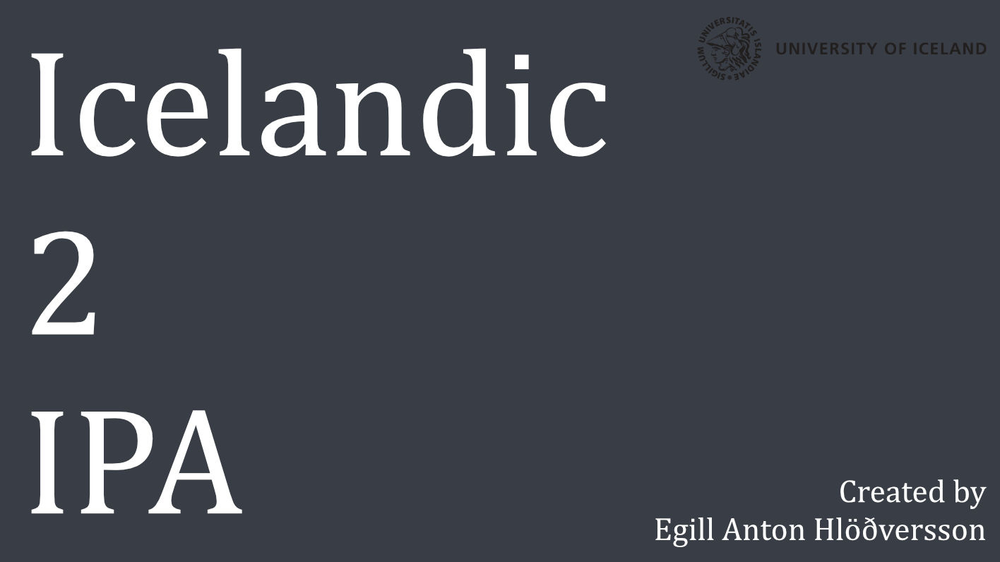

<i>
  Project 2 
  MLT201F Language resources for software development and research, 2019-1  
  University of Iceland - School of Humanitie , Sæmundargata 2, IS-101 Reykjavik, Iceland
</i>

Converter for Icelandic text to IPA and SAMPA phonetic transcription  

## Table of Contents
<!-- ⛔️ MD-MAGIC-EXAMPLE:START (TOC:collapse=true&collapseText=Click to expand) -->

Click to expand

1. [Introduction](#1-introduction)
2. [The Dataset](#2-the-dataset)
3. [Setup](#3-setup)
4. [Authors](#4-authors)
5. [License](#5-license)
6. [References](#6-references)

<!-- ⛔️ MD-MAGIC-EXAMPLE:END -->

## 1 Introduction

## 2 The Dataset

## 3 Setup

## 4 Authors
* [Egill Anton Hlöðversson](https://github.com/egillanton) - MSc. Language Technology Student

## 5 License
This project is licensed under the MIT License - see the [LICENSE](LICENSE) file for details.

## 6 References
* [Malfong.is](http://malfong.is/?pg=framburdur)

🌟 PLEASE STAR THIS REPO IF YOU FOUND SOMETHING INTERESTING 🌟

